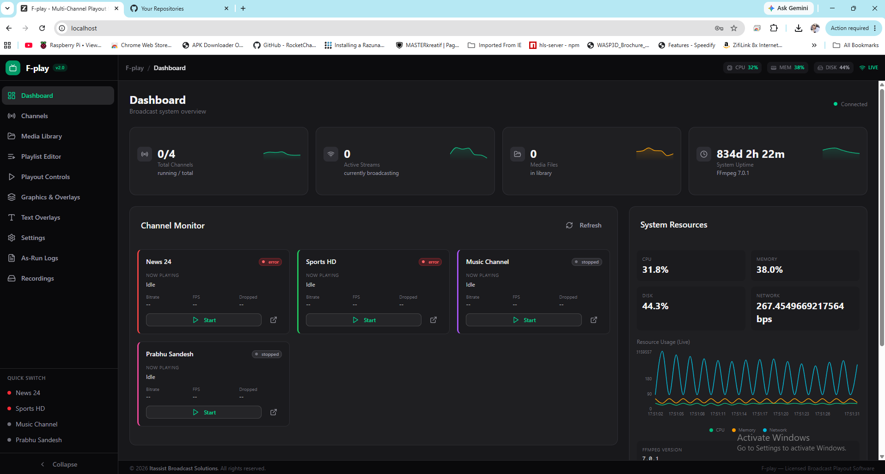
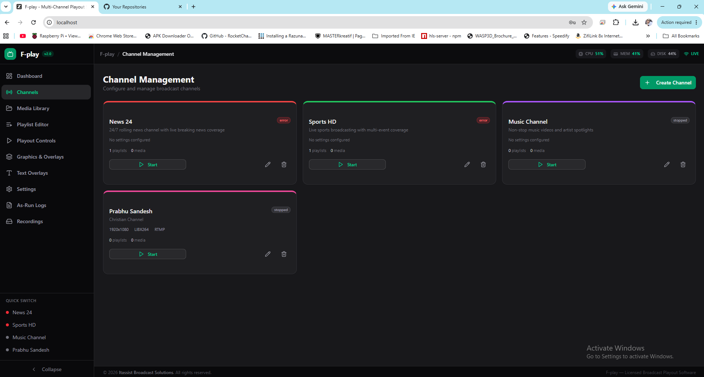
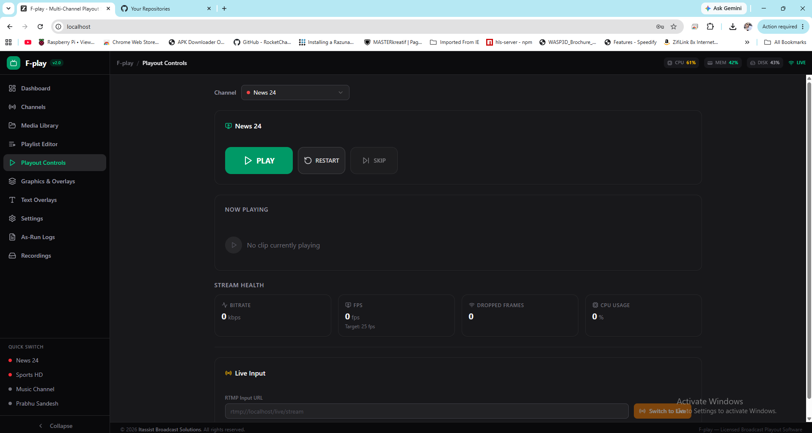
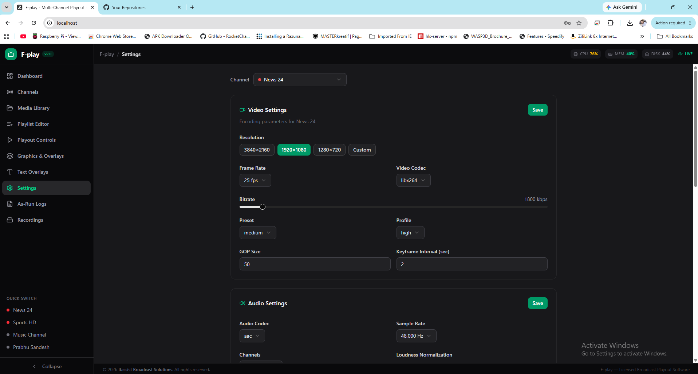

# F-play — Professional Broadcast Playout System

> **Copyright © 2025–2026 Itassist Broadcast Solutions. All rights reserved.**
> This is proprietary, licensed software. Unauthorized copying, distribution, or modification is strictly prohibited.

---

## Overview

**F-play** is a professional-grade, web-based multi-channel broadcast playout and streaming system developed by **Itassist Broadcast Solutions**. It provides frame-accurate scheduling, live logo overlay compositing, real-time stream control, and a modern browser-based operator interface — all powered by FFmpeg and delivered via a containerized Docker architecture.

---

## Screenshots

### Dashboard
Real-time system monitoring with channel status, CPU/memory graphs, and live stream metrics.



### Channel Management
Create and manage multiple broadcast channels with per-channel settings and status indicators.



### Playout Controls
Live stream control panel with start/stop, playlist management, and real-time encoding stats.



### Settings
Per-channel output configuration — resolution, bitrate, FPS, codec, RTMP endpoint, and more.



---

## Key Features

- **Multi-Channel Playout** — Manage multiple independent broadcast channels simultaneously
- **FFmpeg Streaming Engine** — H.264/AAC encoding with RTMP/HLS output
- **Live Logo Overlay** — Real-time logo compositing with alpha transparency, position, size, and opacity control; changes apply instantly without stream interruption
- **Playlist Scheduler** — Drag-and-drop playlist editor with loop and filler support
- **Media Library** — Upload and manage video/audio assets with metadata
- **Graphics & Overlays** — Logo and text overlay management per channel
- **Text Overlays** — Live clock, scrolling tickers, static text, and lower thirds with 2000+ multilingual fonts (Noto CJK, Arabic, Hebrew, Indic, and more)
- **Stream Monitoring** — Real-time status, logs, and as-run logging
- **Recordings** — On-demand recording with conformance monitoring
- **Settings** — Per-channel output configuration (bitrate, resolution, FPS, RTMP key)
- **Mobile Responsive** — Fully responsive dark-mode UI optimized for desktop, tablet, and mobile

---

## Technology Stack

| Layer | Technology |
|---|---|
| Frontend | Next.js 16, React 19, TypeScript 5, TailwindCSS 4, shadcn/ui |
| State | Zustand, TanStack React Query |
| Backend API | Next.js App Router API routes |
| Database | Prisma ORM 6 + SQLite |
| Streaming Engine | Bun + Socket.IO + FFmpeg 7 |
| Containerization | Docker + Docker Compose |
| Reverse Proxy | Caddy |

---

## Architecture

```
┌─────────────────────────────────────────────────────────┐
│                    Docker Compose Stack                  │
│                                                         │
│  ┌──────────┐    ┌──────────────┐    ┌───────────────┐  │
│  │  Caddy   │───▶│   Next.js    │───▶│   SQLite DB   │  │
│  │  Proxy   │    │   App :3000  │    │   (Prisma)    │  │
│  │  :80/443 │    └──────┬───────┘    └───────────────┘  │
│  └──────────┘           │ HTTP Control                  │
│                         ▼                               │
│                  ┌──────────────┐                       │
│                  │  Realtime    │                       │
│                  │  Service     │                       │
│                  │  :3005 (WS)  │                       │
│                  │  :3006 (HTTP)│                       │
│                  └──────┬───────┘                       │
│                         │                               │
│                         ▼                               │
│                  ┌──────────────┐                       │
│                  │   FFmpeg     │──▶ RTMP/HLS Output    │
│                  │  (per chan.) │                       │
│                  └──────────────┘                       │
└─────────────────────────────────────────────────────────┘
```

---

## Deployment

### Requirements

- Docker Engine 24+
- Docker Compose v2

### Quick Start

```bash
# Clone the repository
git clone <repo-url>
cd Fplay

# Copy environment example
cp .env.example .env
# Edit .env with your settings

# Start all services
docker compose up -d

# Access the UI
open http://localhost
```

### Environment Variables

| Variable | Description | Default |
|---|---|---|
| `DATABASE_URL` | SQLite database path | `file:/data/fplay.db` |
| `NEXTAUTH_SECRET` | Auth secret key | — |
| `LOGOS_DIR` | Logo files directory | `/srv/logos` |
| `REALTIME_CONTROL_URL` | Realtime service control URL | `http://realtime:3006` |
| `CONTROL_PORT` | Realtime HTTP control port | `3006` |

---

## Logo Overlay

Fplay supports live logo overlay on streams with:

- **PNG logos** — Full alpha channel transparency (recommended)
- **JPEG logos** — Colorkey background removal via configurable BG color
- **Real-time updates** — Editing position, size, or opacity restarts the FFmpeg process within ~2 seconds, applying changes live
- **Multiple logos** — Stack multiple overlays per channel

---

## License

This software is **proprietary and confidential**.

© 2025–2026 **Itassist Broadcast Solutions**. All rights reserved.

No part of this software may be reproduced, distributed, or transmitted in any form or by any means, including photocopying, recording, or other electronic or mechanical methods, without the prior written permission of Itassist Broadcast Solutions.

For licensing inquiries, contact: **info@itassist.one**

---

*F-play is developed and maintained by Itassist Broadcast Solutions.*
